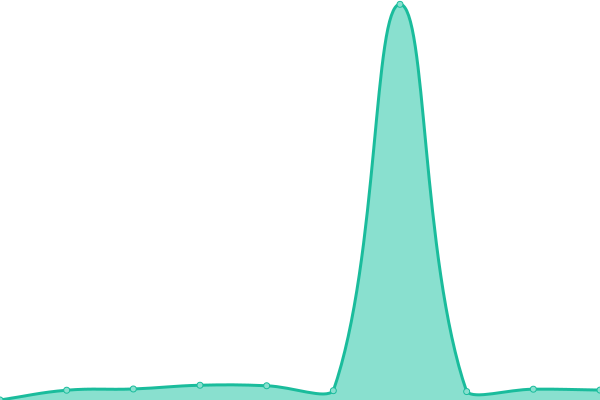

# [📈 Live Status](https://Ismaeltech-sys.github.io/uptime-action): <!--live status--> **🟩 All systems operational**

This repository contains the open-source uptime monitor and status page for [Ismael Pérez Morón](https://cv.ismaeltech.cc), powered by [Upptime](https://github.com/upptime/upptime).

With [Upptime](https://upptime.js.org), you can get your own unlimited and free uptime monitor and status page, powered entirely by a GitHub repository. We use [Issues](https://github.com/Ismaeltech-sys/uptime-action/issues) as incident reports, [Actions](https://github.com/Ismaeltech-sys/uptime-action/actions) as uptime monitors, and [Pages](https://Ismaeltech-sys.github.io/uptime-action) for the status page.

<!--start: status pages-->
<!-- This summary is generated by Upptime (https://github.com/upptime/upptime) -->
<!-- Do not edit this manually, your changes will be overwritten -->
<!-- prettier-ignore -->
| URL | Status | History | Response Time | Uptime |
| --- | ------ | ------- | ------------- | ------ |
|  [CV](https://cv.ismaeltech.cc) | 🟩 Up | [cv.yml](https://github.com/Ismaeltech-sys/uptime-action/commits/HEAD/history/cv.yml) | 

 2342ms
     
 | 

<a href="https://Ismaeltech-sys.github.io/uptime-action/history/cv">96.37%</a>
    

|  [TOOLS DEVOPS](https://it-tools.ismaeltech.cc) | 🟩 Up | [tools-devops.yml](https://github.com/Ismaeltech-sys/uptime-action/commits/HEAD/history/tools-devops.yml) | 

 2206ms
     
 | 

<a href="https://Ismaeltech-sys.github.io/uptime-action/history/tools-devops">96.38%</a>
    

|  [TOOLS OFFICE](https://tools.ismaeltech.cc/) | 🟩 Up | [tools-office.yml](https://github.com/Ismaeltech-sys/uptime-action/commits/HEAD/history/tools-office.yml) | 

 2225ms
     
 | 

<a href="https://Ismaeltech-sys.github.io/uptime-action/history/tools-office">96.39%</a>
    

|  [ENCRYPT](https://enclosed.ismaeltech.cc/) | 🟩 Up | [encrypt.yml](https://github.com/Ismaeltech-sys/uptime-action/commits/HEAD/history/encrypt.yml) | 

 2201ms
     
 | 

<a href="https://Ismaeltech-sys.github.io/uptime-action/history/encrypt">96.40%</a>
    

|  [DRAW](https://draw.ismaeltech.cc/) | 🟩 Up | [draw.yml](https://github.com/Ismaeltech-sys/uptime-action/commits/HEAD/history/draw.yml) | 

 2191ms
     
 | 

<a href="https://Ismaeltech-sys.github.io/uptime-action/history/draw">96.41%</a>
    

|  [MEALIE](https://cook.ismaeltech.cc/) | 🟩 Up | [mealie.yml](https://github.com/Ismaeltech-sys/uptime-action/commits/HEAD/history/mealie.yml) | 

 2220ms
     
 | 

<a href="https://Ismaeltech-sys.github.io/uptime-action/history/mealie">96.42%</a>
    

|  [Google](https://www.google.com/) | 🟩 Up | [google.yml](https://github.com/Ismaeltech-sys/uptime-action/commits/HEAD/history/google.yml) | 

 98ms
     
 | 

<a href="https://Ismaeltech-sys.github.io/uptime-action/history/google">100.00%</a>
    

<!--end: status pages-->

[**Visit our status website →**](https://Ismaeltech-sys.github.io/uptime-action)

## 📄 License

- Powered by: [Upptime](https://github.com/upptime/upptime)
- Code: [MIT](./LICENSE) © [Anand Chowdhary](https://anandchowdhary.com), supported by [Pabio](https://pabio.com)
- Data in the `./history` directory: [Open Database License](https://opendatacommons.org/licenses/odbl/1-0/)
